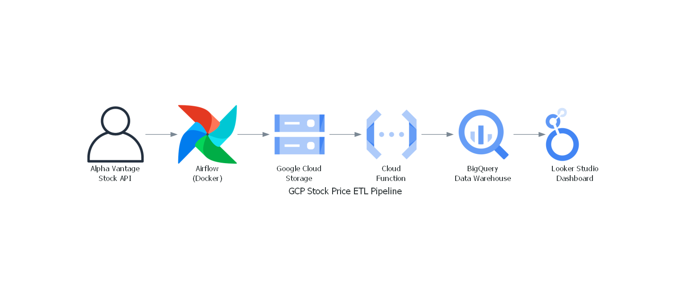
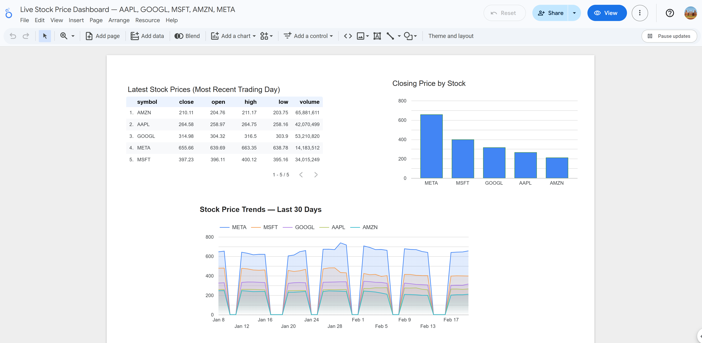
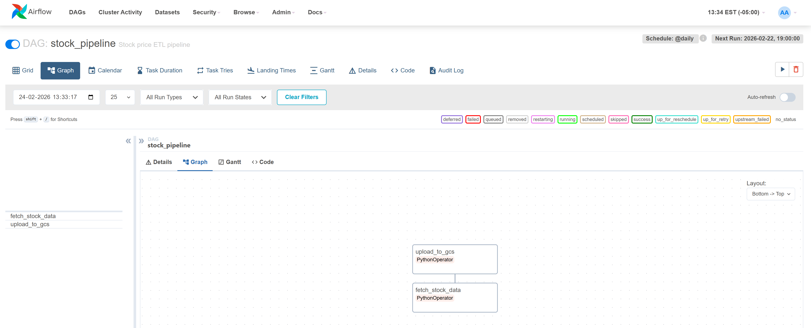

# GCP Stock Price ETL Pipeline

A production-grade data engineering pipeline that automatically fetches real stock prices daily, processes them through a cloud data pipeline, and displays them on a live dashboard.

## Live Dashboard
[View Live Dashboard](https://lookerstudio.google.com/reporting/4c3e15b8-1dd4-4ed1-9c2b-99b4f7b4183e)

## Architecture


## Pipeline in Action

### Looker Studio Dashboard


### Airflow DAG


## Tech Stack
- **Orchestration:** Apache Airflow 2.8.1 (Docker)
- **Cloud:** Google Cloud Platform (GCS, BigQuery, Cloud Functions)
- **Data Warehouse:** BigQuery
- **Transformation:** SQL Views (Moving Average, % Change, Latest Prices)
- **Dashboard:** Looker Studio
- **Language:** Python 3.11

## What It Does
- Fetches daily stock prices for AAPL, GOOGL, MSFT, AMZN, META from Alpha Vantage API
- Saves 150 rows of data to Google Cloud Storage as CSV
- Cloud Function automatically triggers on new file upload and loads data into BigQuery
- SQL views compute 7-day moving average and daily % change
- Live dashboard updates automatically every day

## Upgrades Over Standard Implementation
- dbt transformations on BigQuery ⭐ (in progress)
- Great Expectations data quality checks ⭐ (in progress)
- FastAPI live deployment ⭐ (completed in Project A)

## Project Structure
```
stock-pipeline/
├── dags/
│   ├── stock_pipeline.py    # Airflow DAG
│   └── fetch_data.py        # Alpha Vantage API fetch
├── cloud_function/
│   ├── main.py              # GCS trigger → BigQuery loader
│   └── requirements.txt
├── images/
│   ├── architecture.png
│   ├── dashboard.png
│   └── airflow_dag.png
└── docker-compose.yaml
```

## Setup
1. Clone the repo
2. Add your GCP service account key as `stock-pipeline-key.json`
3. Set `GOOGLE_APPLICATION_CREDENTIALS` environment variable
4. Run `docker-compose up -d`
5. Access Airflow at `http://localhost:8080`